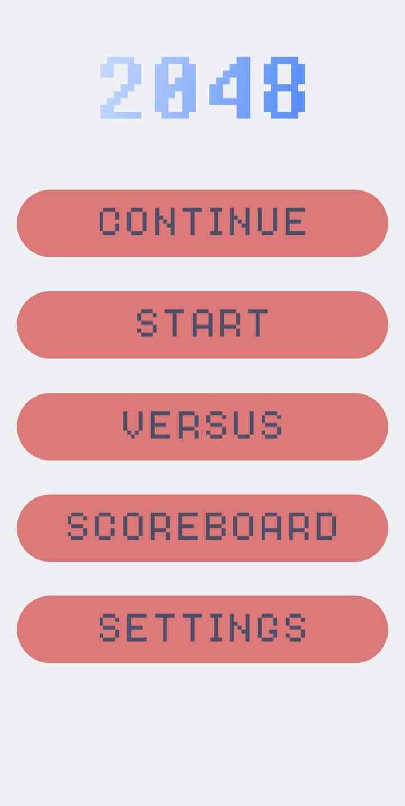
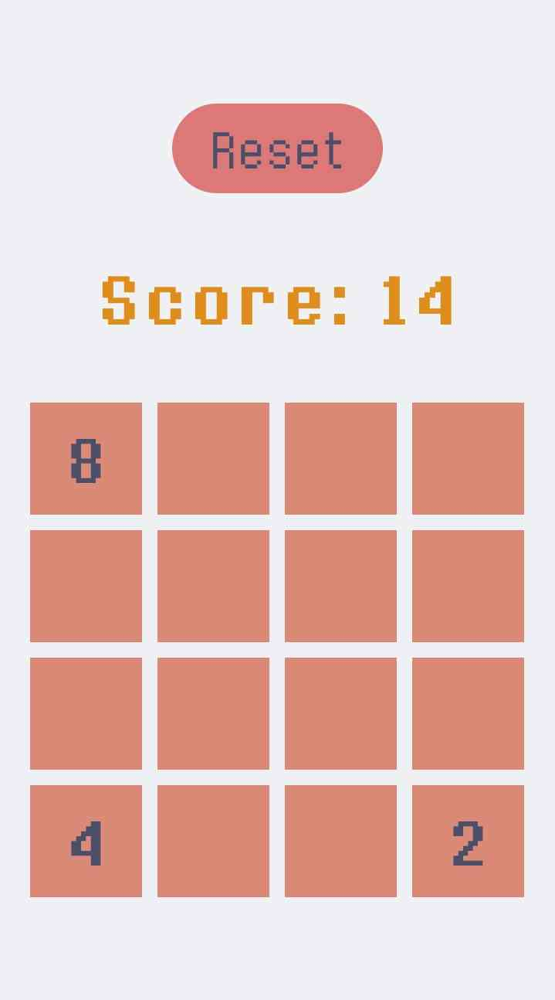
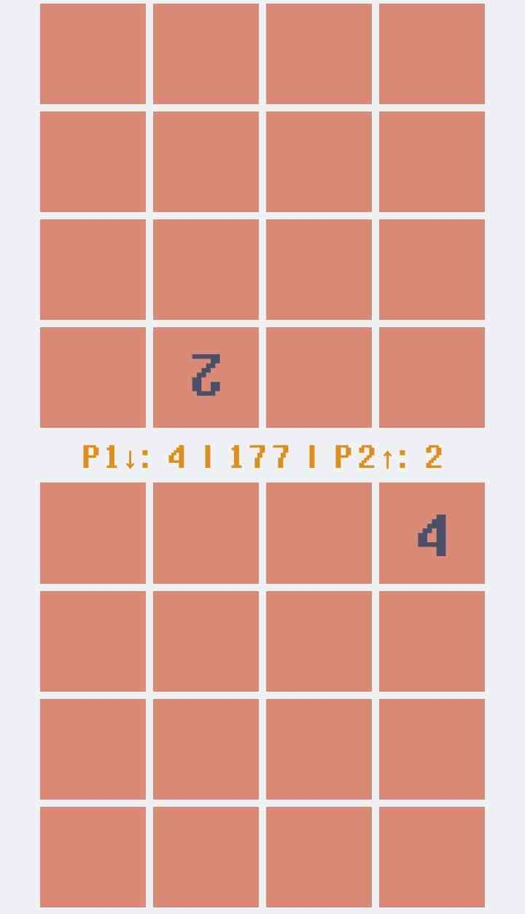
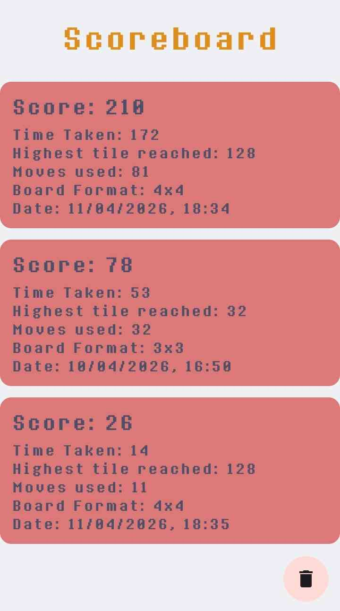
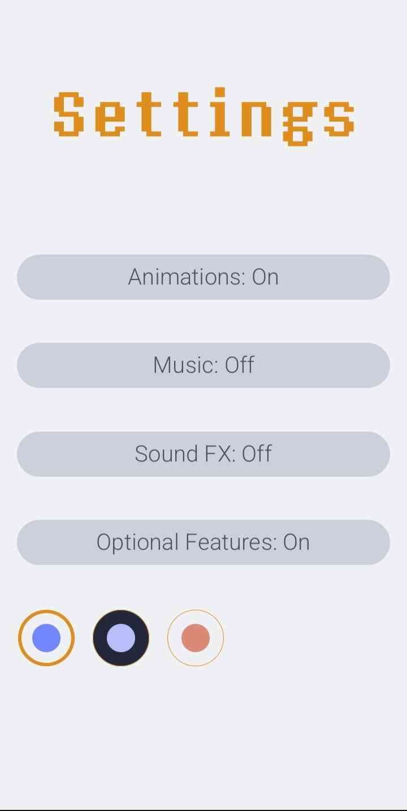
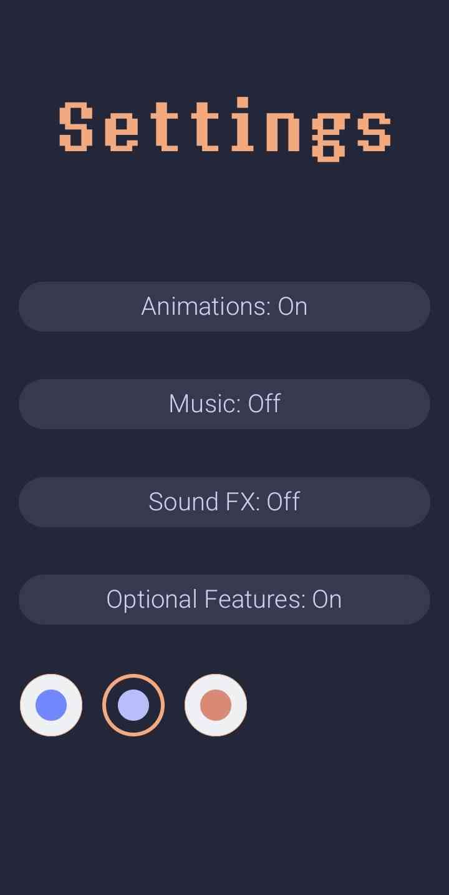
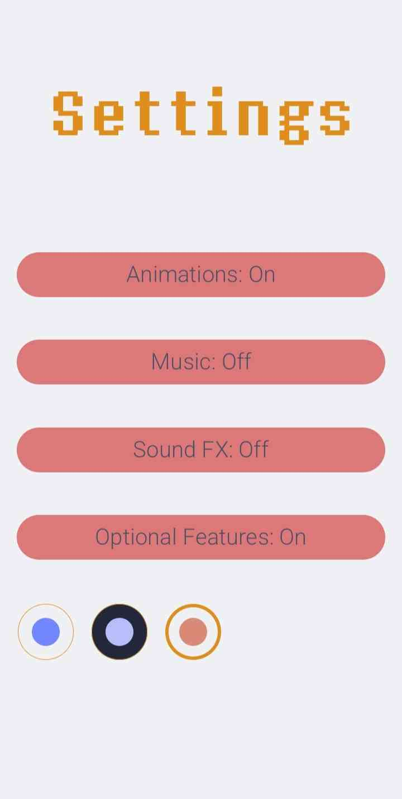

# 2048

An Android 2048 app, inspired by [Gabriele Cirulli's original](https://github.com/gabrielecirulli/2048).

## Features

- 3 Themes
- Music and sound effects
- Multiple grid sizes
- Splitscreen 1vs1 mode
- Scoreboard
- Continue paused games

## Screenshots



## Development

Developped in Kotlin, with Gradle and Android API 36.0

## Nix

A Nix-based development environment and emulator is available:

```bash
nix-shell -A shell # launch dev environment

./gradlew assembleDebug # compile a debug apk
nix-build -A emulate # create the emulator script
./result/bin/run-test-emulator # launch the emulator
```
